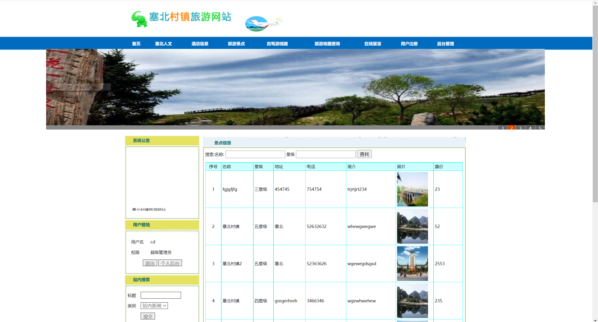

## 基于JSP+Servlet实现的旅游网站系统(程序+报告)

- <b>完整代码获取地址：从戎源码网 ([https://armycodes.com/](https://armycodes.com/))</b>
- <b>技术探讨、资料分享，请加QQ群：692619798</b> 
- <b>作者微信：19941326836  QQ：952045282</b> 
- <b>承接计算机毕业设计、Java毕业设计、Python毕业设计、深度学习、机器学习</b>
- <b>选题+开题报告+任务书+程序定制+安装调试+论文+答辩ppt 一条龙服务</b>
- <b>所有选题地址 ([https://github.com/YuLin-Coder/AllProjectCatalog](https://github.com/YuLin-Coder/AllProjectCatalog)) </b>

## 项目介绍
基于JSP+Servlet实现的旅游网站系统，主要功能如下

（1）主界模块设计：
	首页效果、首页塞北人文、首页酒店信息、首页景点信息、自驾游路线
	首页天气预报、在线留言、用户注册、首页后台登录
（2）用户注册模块：
	用户注册完成后，经过管理员的审核以后方能成功登录。
	用户注册成功以后，可以进行预订管理，个人信息管理以及旅游路线管理等功能
（3）旅游景点模块：
	供用户快速便捷的搜索到自己想要的旅游景点信息。
	景点信息展示、景点名称查询、旅游景点效果图，该部分风景的查询与显示。
（4）酒店预定模块：
	客户登录，可以进行具体资料查看操作。
	酒店详细信息、酒店预订、酒店预订成功、酒店预订成功列表所示，可以清晰的展现出酒店订购模块的具体操作和运行效果。
（5）后台管理设计：
管理员登录后，可以实施各种操作。实现对网站基本信息的管理。
系统功能列表里主要包括：
1.账号管理，在这里管理员可以修改个人信息，包括密码和个人资料等等。
2.用户注册管理部分是对该网站的申请注册的用户进行验证通过，管理员可以对所有用户进行删除修改和审核。
3.塞北人文添加模块主要是对该网站中塞北人文的管理，管理员可以对塞北人文进行更新修改和删除。
4.塞北故事管理模块。
5.塞北景点进行操作。
6.自驾游路线管理。
7.酒店信息管理模块。
8.留言板管理较为简单。
9.最后包括修改密码和退出登录模块。

## 项目技术
- 编程语言：Java
- 数据库：MySQL
- 前端技术：JSP、JavaScript、bootstrap、JQuery
- 后端技术：Servlet、JDBC

## 运行环境
- JDK版本：JDK1.8及以上
- 开发工具：IDEA、Ecplise、Myecplise都可以
- 数据库: MySQL5.7及以上

## 运行截图

